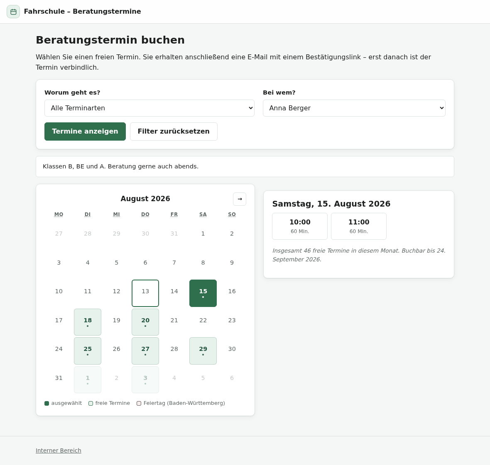
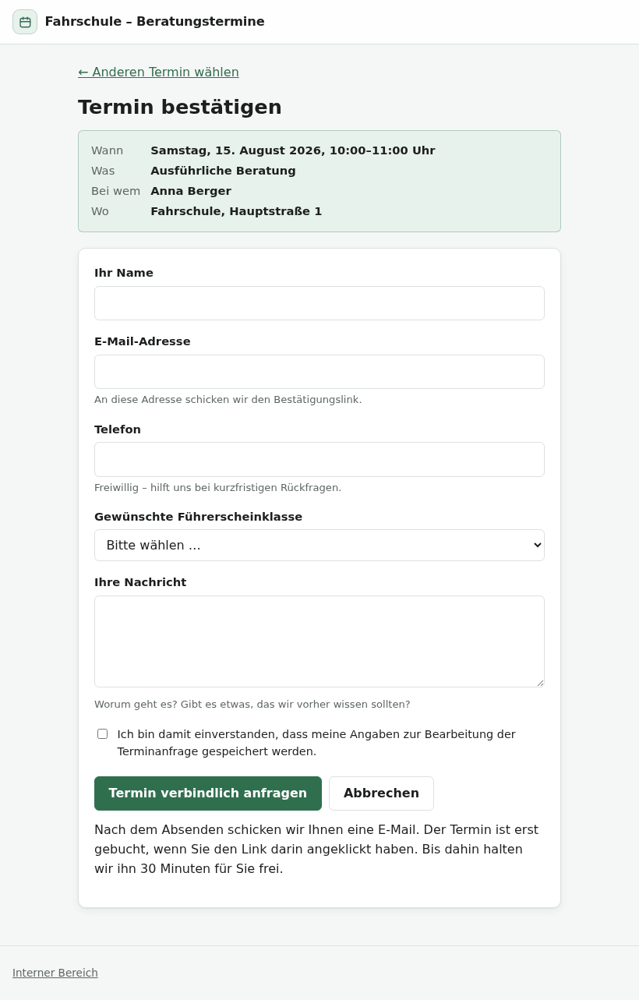
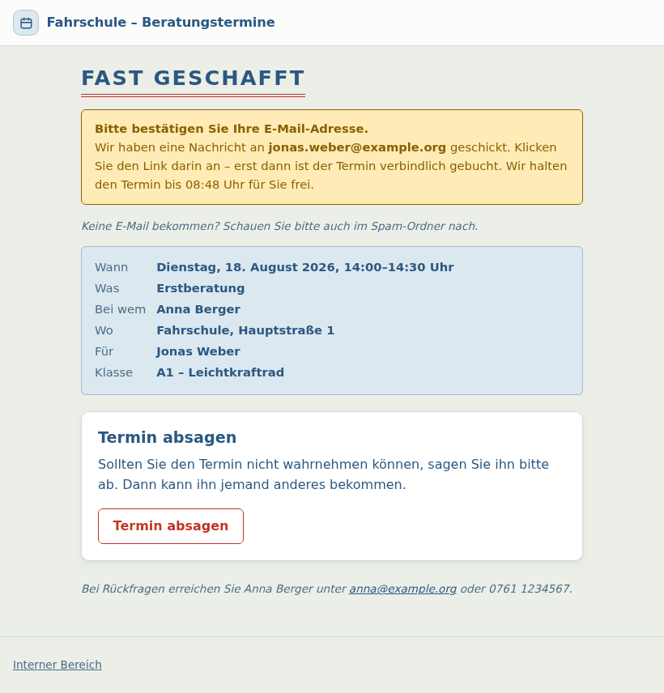
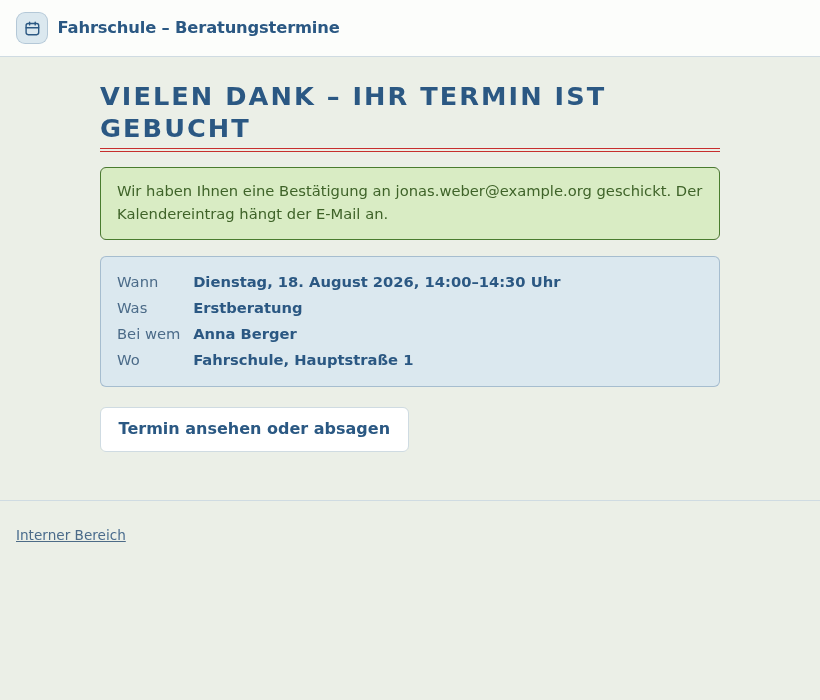
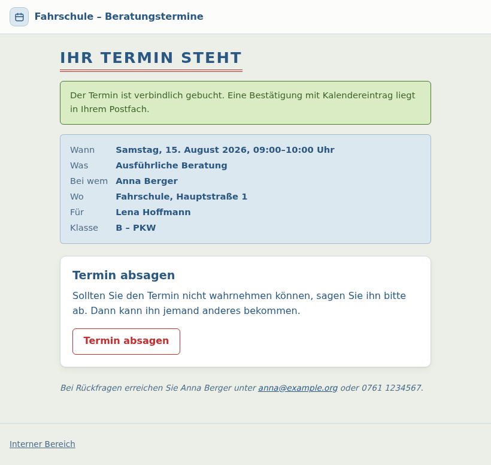
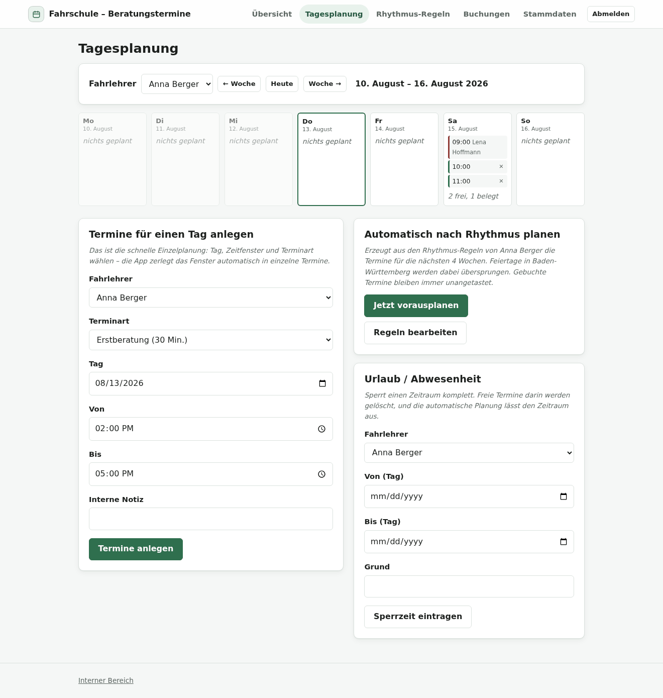
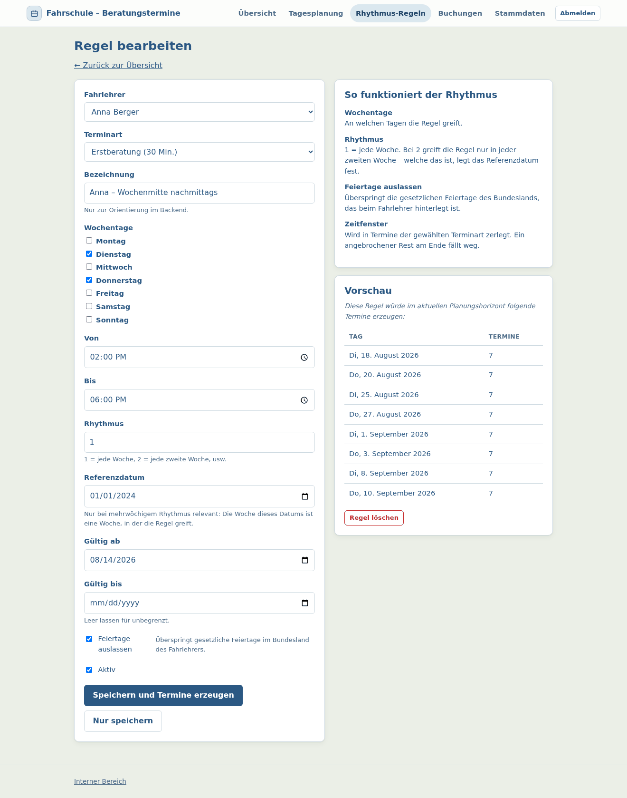
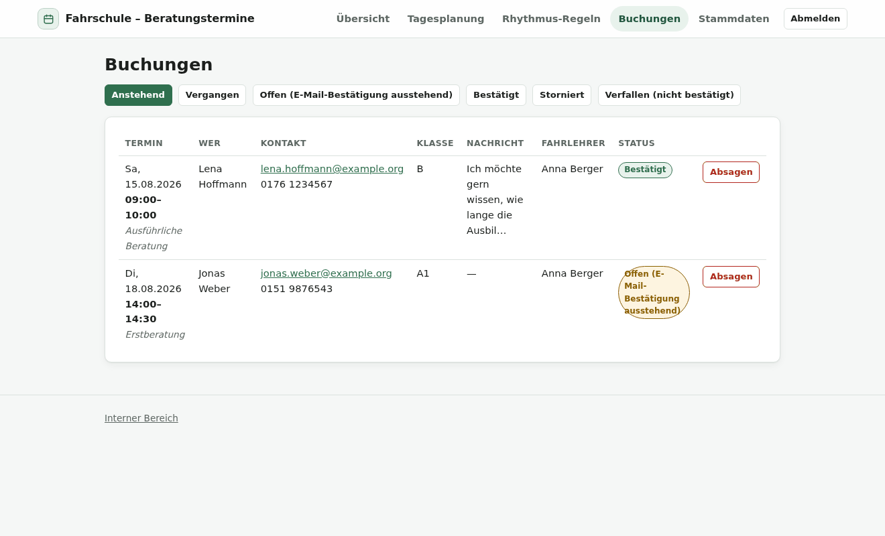
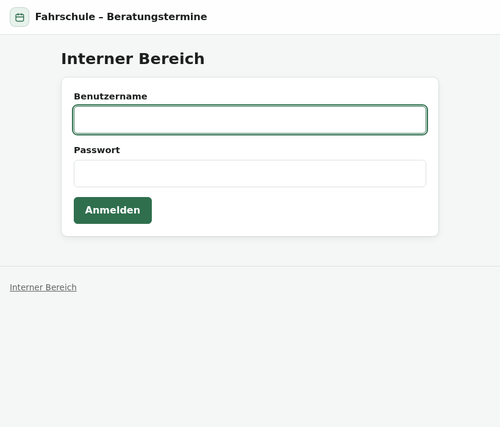
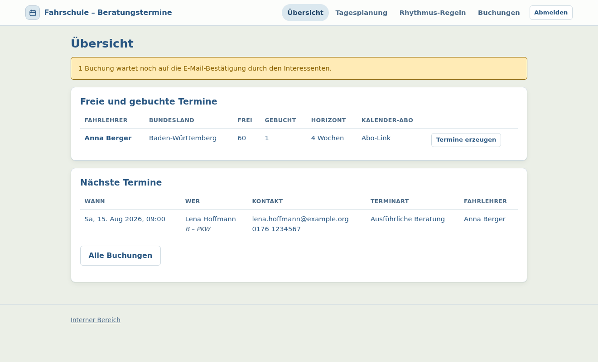

# Schalti Termine

Öffentliche Terminbuchung für Fahrschul-Beratungen. Eigenständige Django-App,
die ohne Nextcloud läuft.

Der Kerngedanke: **jeder Tag lässt sich einzeln planen** – passend zu den
unregelmäßigen Arbeitszeiten eines Fahrlehrers – und **zusätzlich** lassen sich
wiederkehrende Rhythmen hinterlegen, aus denen die App Termine automatisch für
mehrere Wochen im Voraus bereitstellt. Gesetzliche Feiertage werden dabei
anhand des Bundeslands übersprungen.



> Grün hinterlegte Tage haben freie Termine; der gewählte Tag steht rechts mit
> seinen Uhrzeiten. Die Filter oben erscheinen nur, wenn es tatsächlich etwas
> zu wählen gibt – bei einem Fahrlehrer und einer Terminart entfallen sie.

---

## Inhalt

- [Was die App kann](#was-die-app-kann)
- [Der Weg des Interessenten](#der-weg-des-interessenten)
- [Die zwei Planungswege](#die-zwei-planungswege)
- [Der interne Bereich](#der-interne-bereich)
- [Wie der Login gelöst ist](#wie-der-login-gelöst-ist)
- [Technik](#technik)
- [Schnellstart](#schnellstart-entwicklung)
- [Betrieb mit Docker](#betrieb-mit-docker)
- [Terminplanung einrichten](#so-richtet-man-die-terminplanung-ein)
- [Kommandos](#kommandos)
- [Kalender-Abo](#kalender-abo-einrichten)
- [Datenschutz](#datenschutz)
- [Grenzen und offene Punkte](#grenzen-und-offene-punkte)
- [Tests](#tests)
- [Aufbau des Codes](#aufbau-des-codes)

---

## Was die App kann

### Für Interessenten (öffentlich, ohne Login)

- Monatskalender mit allen freien Terminen
- Filter nach Terminart und Fahrlehrer – aber nur dort, wo es etwas zu wählen gibt
- Buchung mit Name, E-Mail, Telefon, Führerscheinklasse und Nachricht
- Double-Opt-in: verbindlich erst nach Klick auf den Link in der E-Mail
- Bestätigungsmail mit Kalendereintrag (`.ics`) im Anhang
- Selbstständiges Absagen über einen persönlichen Link
- Erinnerungsmail vor dem Termin
- Die Terminauswahl lässt sich als Baustein in die Seite der Fahrschule
  einbetten ([Anleitung](docs/EINBETTEN.md))

### Für die Fahrschule (interner Bereich)

- **Tagesplanung**: Wochenansicht, in der jeder Tag einzeln beplant wird
  („am 17.09. von 14:00 bis 17:00 Beratungen anbieten“)
- **Rhythmus-Regeln**: wiederkehrende Verfügbarkeiten, wöchentlich oder in
  mehrwöchigem Takt, mit Gültigkeitszeitraum
- **Feiertage pro Bundesland**: werden bei der automatischen Planung ausgelassen
- **Sperrzeiten** für Urlaub und Abwesenheit
- Buchungsübersicht mit Absage-Funktion (der Kunde wird automatisch informiert)
- **Kalender-Abo** (`.ics`-URL) für Outlook, Google Kalender oder Apple Kalender
- Mehrere Fahrlehrer, jeder mit eigenen Regeln, eigenem Bundesland und eigenem Kalender
- Django-Admin für die Stammdaten

---

## Der Weg des Interessenten

Vier Schritte, kein Benutzerkonto. Wer einen Termin buchen will, soll buchen –
nicht sich registrieren.

<table>
<tr>
<td width="50%" valign="top">

**1 · Termin wählen und Formular ausfüllen**

Die Zusammenfassung oben zeigt Zeit, Terminart, Fahrlehrer und Ort. Die
Führerscheinklasse lässt sich pro Terminart ein- und ausblenden.



</td>
<td width="50%" valign="top">

**2 · E-Mail bestätigen**

Der Termin ist reserviert, aber noch nicht gebucht. Bleibt der Klick aus, wird
er nach 30 Minuten automatisch wieder freigegeben.



</td>
</tr>
<tr>
<td width="50%" valign="top">

**3 · Termin steht**

Nach dem Klick ist die Buchung verbindlich. Kunde und Fahrlehrer bekommen je
eine Mail, beide mit Kalendereintrag im Anhang.



</td>
<td width="50%" valign="top">

**4 · Später absagen**

Derselbe Link bleibt gültig. Sagt der Kunde ab, wird der Termin sofort wieder
für andere freigegeben.



</td>
</tr>
</table>

---

## Die zwei Planungswege

Termine sind **konkrete Zeilen in der Datenbank**, keine Regeln, die bei jedem
Seitenaufruf durchgerechnet werden. Genau deshalb lässt sich ein einzelner
Termin löschen, ohne die Regel anzufassen – und deshalb können Handplanung und
Automatik dieselbe Sorte Termin erzeugen und friedlich nebeneinander leben.

Der Generator (`termine/services/planung.py`) läuft täglich als Hintergrundjob
und lässt sich jederzeit von Hand anstoßen. Er hält vier Zusagen ein, die alle
durch Tests abgesichert sind:

1. Er fasst **nur die Zukunft** an.
2. Er löscht **nie** einen gebuchten oder reservierten Termin.
3. Er löscht **nie** einen von Hand angelegten Termin.
4. Er ist **idempotent** – zweimal laufen lassen ändert nichts.

Wird eine Regel geändert oder deaktiviert, verschwinden die noch freien Termine
aus dieser Regel; bereits gebuchte bleiben stehen. Das ist genau das Verhalten,
das man will: eine Planänderung darf niemandem den Termin unter dem Stuhl
wegziehen.

---

## Der interne Bereich

### Tagesplanung

Die Wochenansicht ist der Arbeitsplatz. Grün markierte Termine sind frei und
lassen sich einzeln mit dem `×` entfernen, rote sind gebucht und tragen den
Namen des Interessenten. Darunter das Formular für die schnelle Einzelplanung:
Tag, Zeitfenster, Terminart – die App zerlegt das Fenster selbst in einzelne
Termine.



> Die Aufnahme entstand in einem Browser mit englischer Oberfläche – daher
> `08/13/2026` und `02:00 PM` in den Auswahlfeldern. Ein deutscher Browser
> schreibt dort `13.08.2026` und `14:00`; siehe
> [Datum und Uhrzeit](#datum-und-uhrzeit).

### Rhythmus-Regeln

Eine Regel beschreibt eine wiederkehrende Verfügbarkeit. Die Vorschau rechts
zeigt sofort, welche Termine dabei herauskommen – man muss nicht erst speichern
und dann nachsehen.



### Buchungen

Alle Anmeldungen mit Kontaktdaten, Führerscheinklasse und Nachricht. Eine
Absage von hier aus gibt den Termin wieder frei und schickt dem Kunden
automatisch eine Mail samt Storno-Kalendereintrag.



---

## Wie der Login gelöst ist

Es gibt **kein Kundenkonto**. Interessenten buchen ohne Registrierung; ihre
eigene Buchung erreichen sie über einen geheimen Link aus der E-Mail. Ein
Passwort brauchen nur die Leute in der Fahrschule.

| Wer | Wie | Was sichtbar ist |
| --- | --- | --- |
| **Interessent** | gar kein Login | Kalender, freie Termine, Buchungsformular |
| **Eigener Termin** | geheimer Link aus der E-Mail | nur die eigene Buchung: ansehen, bestätigen, absagen |
| **Kalender-Abo** | geheime `.ics`-URL | Nur-Lese-Feed der bestätigten Termine eines Fahrlehrers |
| **Fahrlehrer** | Benutzername + Passwort | ausschließlich die **eigene** Planung, eigene Regeln, eigene Buchungen |
| **Inhaber** | Benutzername + Passwort, `is_staff` | alle Fahrlehrer, zusätzlich der Django-Admin für Stammdaten |

<table>
<tr>
<td width="50%" valign="top">



Anmeldung unter `/intern/anmelden/` – Djangos eingebaute `LoginView`, nur mit
eigener Vorlage.

</td>
<td width="50%" valign="top">



Dieselbe Übersichtsseite als Fahrlehrerin Anna: nur ihre eigene Zeile, und in
der Navigation fehlt der Punkt „Stammdaten“.

</td>
</tr>
</table>

### Wie die Trennung technisch durchgesetzt wird

Ein Fahrlehrer-Datensatz kann mit einem Django-Benutzer verknüpft werden.
Daraus ergibt sich die Sichtbarkeit – an genau zwei Stellen, nicht verstreut
über die Seiten:

```python
# 1. Türsteher: eingeloggt UND (Staff ODER mit Fahrlehrer-Profil)
if not (request.user.is_staff or hasattr(request.user, "fahrlehrer")):
    raise PermissionDenied("Kein Zugriff auf den internen Bereich.")

# 2. Sichtbarkeit: Staff sieht alle, ein Fahrlehrer nur sich selbst
def _erlaubte_fahrlehrer(user):
    if user.is_staff:
        return Fahrlehrer.objects.filter(aktiv=True)
    return Fahrlehrer.objects.filter(pk=user.fahrlehrer.pk)
```

Jede Abfrage und jede Aktion im internen Bereich filtert über diese eine
Funktion. Greift jemand auf einen fremden Termin zu, kommt `404` zurück und
nicht `403` – die App verrät damit nicht einmal, dass es den Termin gibt.

### Was sonst noch abgesichert ist

| Bereich | Umsetzung |
| --- | --- |
| **Passwörter** | Djangos Standardverfahren (PBKDF2-SHA256). Das schnelle Testverfahren ist hinter einer Abfrage abgeriegelt und kann im Betrieb nicht aktiv werden. |
| **Links in E-Mails** | 256-Bit-Zufallstoken aus `secrets.token_urlsafe(32)`, eindeutig und nicht über die Oberfläche änderbar. |
| **Kalender-Abo** | Eigener Token pro Fahrlehrer. Ist er in falsche Hände geraten, setzt eine Aktion im Admin ihn neu – das alte Abo wird damit ungültig. |
| **Sitzungen** | Session- und CSRF-Cookie werden im Betrieb nur über HTTPS gesendet; alle Formulare sind CSRF-geschützt. |
| **Formular-Spam** | Verstecktes Honigtopf-Feld im Buchungsformular; ausgefüllt bedeutet Bot, und die Buchung wird verworfen. |
| **Doppelbuchung** | Drei Ebenen: Sperre auf der Termin-Zeile, Statusprüfung in derselben Transaktion und ein Unique-Index in der Datenbank. |

---

## Technik

| Baustein | Wahl | Warum |
| --- | --- | --- |
| Backend | Django 5.2 | Admin, Migrationen, Auth und Formulare sind fertig dabei |
| Frontend | Serverseitige Templates + htmx | Ein Projekt statt zwei, funktioniert auch ohne JavaScript |
| Styling | Handgeschriebenes CSS (`static/css/app.css`) | Kein Node-Build-Schritt im Deployment |
| Datenbank | PostgreSQL, alternativ SQLite | SQLite reicht für eine Einzelplatz-Installation |
| Hintergrundjobs | django-q2 | Nutzt die vorhandene Datenbank, kein Redis nötig |
| Feiertage | [`holidays`](https://pypi.org/project/holidays/) | Alle 16 Bundesländer, komplett offline |
| Kalender | `icalendar` | `.ics`-Anhang und Abo-Feed |

htmx liegt als eine Datei unter `static/js/` – es gibt bewusst keinen
Paketmanager fürs Frontend.

### Farben

Die Palette stammt von der Seite der Fahrschule, weil die Buchung von dort aus
aufgerufen wird und der Sprung nicht wie ein Seitenwechsel wirken soll: das
warme Papierweiß des Hintergrunds (`#ebefe7`), das Graublau für Schrift und
Marke (`#2b5883`), der rote Akzent (`#c72e2e`) und die Pastelltöne der
Abschnitte. Die öffentliche Seite greift zusätzlich die Schreibweise der
Überschriften auf – gesperrte Versalien über einem doppelten roten Strich.
Der interne Bereich bleibt sachlich; dort wird gearbeitet, nicht empfangen.

Zwei Töne sind bewusst nachgeschärft, weil sie dort nur große Überschriften
tragen, hier aber Fließtext und Bedienelemente:

| Von der Fahrschulseite | Hier | Warum |
| --- | --- | --- |
| `#5b7995` | `#4d6b87` | 3,9:1 auf dem Hintergrund reicht für Fließtext nicht (jetzt 4,8:1) |
| `#3673b9` | ungenutzt | 4,2:1 – für Text zu wenig; Zeigen und Fokus nutzen das dunklere `#1f4467` |

**Grün bleibt Grün.** Die Markenfarbe färbt Knöpfe, Links, den aktiven
Navigationspunkt und den gewählten Tag. Freie Termine, Erfolgsmeldungen und
das Statuszeichen „Frei" behalten ihr Grün – im Kalender wird nichts so schnell
verstanden wie ein grüner Tag. Es ist auf die Pastelltöne der Fahrschulseite
abgestimmt, nicht mehr das alte Sattgrün.

Alles hängt an Variablen in `static/css/app.css`; ein Wechsel der Palette sind
zwölf Zeilen, hell und dunkel getrennt. Schrift auf gefüllten Flächen läuft
über `--auf-akzent` statt über ein festes Weiß – in der dunklen Fassung ist der
Akzent hell, dort wäre weiße Schrift unlesbar.

### Datum und Uhrzeit

Überall Tag.Monat.Jahr mit führender Null und die 24-Stunden-Uhr. Die Vorlagen
benutzen dafür Djangos benannte Formate (`SHORT_DATE_FORMAT`) statt
handgeschriebener Buchstabenfolgen – die richten sich nach `LANGUAGE_CODE`,
und der steht auf `de`.

Eine Sache liegt allerdings **nicht** bei der App: Die Auswahlfelder für Datum
und Uhrzeit (`<input type="date">`, `<input type="time">`) zeichnet der Browser
selbst, und zwar in *seiner* Sprache. Ein Chrome mit englischer Oberfläche
zeigt darin `08/13/2026` und `02:00 PM`, ein deutscher `13.08.2026` und
`14:00` – bei derselben Seite. Eine Webseite kann das nicht umstellen; es gibt
kein Attribut dafür. Was die App liefern muss, ist das `value` in ISO-Form
(`2026-08-13`), so schreibt es der HTML-Standard vor – steht dort etwas
anderes, bleibt das Feld schlicht leer. Genau das prüft ein Test.

Wer die Felder unabhängig vom Browser deutsch haben will, müsste die nativen
Auswahlfelder durch einen selbstgebauten Kalender ersetzen. Das kostet die
guten Datumsauswahlen der Handy-Tastaturen und bringt JavaScript ins Projekt –
beides passt nicht zu den Entscheidungen, auf denen diese App steht.

### Kopfzeile und Navigation

Die Kopfzeile bleibt beim Scrollen stehen und legt sich milchig über den
Inhalt. Die Punkte des internen Bereichs sind Pillen; der Bereich, in dem man
gerade steht, ist eingefärbt und für Screenreader zusätzlich mit
`aria-current="page"` ausgezeichnet. Zu einem Punkt gehören auch seine
Unterseiten – das Regelformular färbt „Rhythmus-Regeln" ein, nicht nichts.

Unter 760 px klappt die Navigation hinter einen Schalter. Dahinter steckt ein
`<details>`-Element und kein Skript: Damit funktioniert das Menü auch ohne
JavaScript, passend zum Rest der App. Auf breiten Bildschirmen nimmt das
Stylesheet die Klappmechanik wieder zurück und zeigt eine Leiste.

---

## Schnellstart (Entwicklung)

```bash
python3 -m venv .venv
source .venv/bin/activate
pip install -r requirements.txt

cp .env.example .env          # SITE_BASE_URL auf http://localhost:8000 setzen

python manage.py migrate
python manage.py beispieldaten     # Demo-Fahrschule inklusive Termine
python manage.py runserver
```

Danach erreichbar:

| Adresse | Was |
| --- | --- |
| <http://localhost:8000/> | Öffentliche Buchungsseite |
| <http://localhost:8000/intern/> | Interner Bereich (`admin` / `admin`) |
| <http://localhost:8000/django-admin/> | Stammdaten |

Ohne `EMAIL_HOST` in der `.env` werden alle E-Mails auf der Konsole ausgegeben –
die Bestätigungslinks lassen sich also direkt aus dem Terminal kopieren.

### Der erste Schritt: ein Verwaltungskonto

Wer `beispieldaten` überspringt, steht nach `migrate` vor einer leeren
Installation: Es gibt keinen Superuser, also kommt niemand in den Admin; ohne
Admin gibt es keine Terminart und keinen Fahrlehrer; und ohne die beiden ist
der Kalender leer. Alles funktioniert – nur passiert nichts.

Damit das nicht wie ein Defekt aussieht, sagen es die betroffenen Seiten
selbst. Solange kein Superuser existiert, steht auf der Anmeldeseite des
internen Bereichs, auf der Anmeldung des Django-Admins und auf der öffentlichen
Buchungsseite ein Hinweis mit dem passenden Befehl:

```bash
python manage.py createsuperuser
```

Läuft die App im Container, nennt der Hinweis von sich aus die Docker-Variante.
Sobald das Konto steht, verschwindet er überall – Interessenten bekommen also
nie einen Terminalbefehl zu sehen.

---

## Betrieb mit Docker

```bash
cp .env.example .env          # ausfüllen, besonders DJANGO_SECRET_KEY und SITE_BASE_URL
docker compose up -d --build
docker compose exec web python manage.py createsuperuser
```

> **Ausführlich in [docs/EINRICHTUNG.md](docs/EINRICHTUNG.md):** jedes Feld der
> `.env` einzeln erklärt, Sicherung und Aktualisierung – und eine Liste der
> Meldungen, mit denen der Start abbricht, samt dem, was dann zu tun ist.

Wer auf dem Server keinen Reverse Proxy betreibt, nimmt die mitgelieferte
Ergänzung: Sie stellt Caddy davor, das sich das TLS-Zertifikat selbst holt.

```bash
docker compose -f docker-compose.yml -f docker-compose.tls.yml up -d --build
```

Läuft dort bereits nginx oder Traefik, bleibt diese Datei ungenutzt und der
vorhandene Proxy zeigt auf `127.0.0.1:8000`.

`docker compose` startet drei Container: die Datenbank, den Webserver
(gunicorn) und einen Worker, der die wiederkehrenden Jobs abarbeitet.
Migrationen und die Job-Einrichtung laufen beim Start des Web-Containers
automatisch mit.

Davor prüft der Container die Konfiguration und **bricht bei einem Fehler ab**,
statt loszulaufen. Das betrifft vor allem zwei Werte, die eine Installation
still unbrauchbar machen können:

- `SITE_BASE_URL` zeigt noch auf `localhost` – dann gingen alle Bestätigungs-
  und Storno-Links ins Leere, denn sie entstehen in Hintergrundjobs ohne
  Request, aus dem sich der Hostname ableiten ließe.
- Es ist kein Mailversand eingerichtet – dann bekäme niemand einen
  Bestätigungslink, und keine einzige Buchung käme zustande.
- Ein Geheimnis steht noch auf `bitte-aendern`, oder `EMAIL_HOST` zeigt auf
  einen Beispielserver. Beides sieht nach fertiger Konfiguration aus und ist
  keine.

Selbst prüfen lässt sich das jederzeit mit `python manage.py check --deploy`.

Vor die App gehört ein Reverse Proxy mit TLS (nginx, Caddy, Traefik). Der
Webserver lauscht absichtlich nur auf `127.0.0.1`.

### Woran man sieht, dass die Anlage läuft

Beide Container prüfen sich selbst; `docker compose ps` zeigt das Ergebnis als
`healthy` oder `unhealthy`.

| Container | Was geprüft wird |
| --- | --- |
| `web` | `GET /healthz` – antwortet gunicorn, **und** ist die Datenbank erreichbar? |
| `worker` | `python manage.py jobs_pruefen` – läuft der Fahrplan der Jobs weiter? |

Für den Worker taugt kein Prozess-Check: `qcluster` kann laufen und trotzdem
nichts abarbeiten. Geprüft wird deshalb der Fahrplan selbst. django-q2 schiebt
den nächsten Ausführungszeitpunkt nach jedem Lauf weiter; bleibt er in der
Vergangenheit stehen, arbeitet niemand die Warteschlange ab. Der häufigste Job
läuft alle fünf Minuten, eine Viertelstunde Rückstand ist also ein klares
Zeichen. Das ist genau die Sorte Ausfall, die sonst tagelang unbemerkt bleibt:
Es stürzt nichts ab, es kommen nur keine Termine mehr dazu.

Daran hängt auch die Startreihenfolge. Der Worker wartet nicht mehr nur auf die
Datenbank, sondern auf einen gesunden `web`-Container – dort laufen Migration
und Job-Einrichtung. Vorher startete er regelmäßig zu früh, fand seine Tabellen
nicht und starb so lange, bis der Neustart zufällig spät genug kam.

`/healthz` ist ohne Login erreichbar und antwortet bewusst nur `ok` oder
`fehler`; woran es hakt, steht im Log. Wer die Adresse aus dem Netz fernhalten
will, sperrt sie im Reverse Proxy – die Container prüfen sich selbst und
brauchen sie von außen nicht.

---

## So richtet man die Terminplanung ein

1. **Terminart anlegen** (Django-Admin → Terminarten): Bezeichnung, Dauer,
   optional ein Puffer danach und ein Ort. Die Dauer bestimmt, in welche
   Häppchen ein Zeitfenster zerlegt wird.

2. **Fahrlehrer anlegen** (Django-Admin → Fahrlehrer):
   - **Bundesland** – entscheidet über die Feiertage
   - **Planungshorizont** – wie viele Wochen im Voraus geplant wird (z. B. 4)
   - **Mindest-Vorlauf** – wie kurzfristig noch gebucht werden darf
   - optional einen Login-Benutzer verknüpfen, damit die Person die eigene
     Tagesplanung selbst pflegen kann

3. **Rhythmus-Regel anlegen** (Interner Bereich → Rhythmus-Regeln), zum Beispiel
   „Di + Do, 14:00–18:00, wöchentlich“. Bei einem mehrwöchigen Takt legt das
   Referenzdatum fest, welche Woche gemeint ist. Die Vorschau auf der
   Bearbeitungsseite zeigt sofort, welche Termine dabei herauskommen.

4. **Einzelne Tage nachpflegen** (Interner Bereich → Tagesplanung): zusätzliche
   Zeitfenster eintragen, einzelne Termine wieder löschen, Urlaub sperren.

Manuell angelegte Termine und die aus Regeln erzeugten leben friedlich
nebeneinander – der Generator fasst manuelle Termine nie an.

---

## Kommandos

```bash
python manage.py termine_generieren                  # alle Fahrlehrer
python manage.py termine_generieren --fahrlehrer anna-berger --wochen 8
python manage.py buchungen_pflegen                   # Reservierungen, Erinnerungen, DSGVO
python manage.py jobs_einrichten                     # wiederkehrende Jobs registrieren
python manage.py jobs_pruefen                        # läuft der Fahrplan noch? (0 = ja)
python manage.py qcluster                            # Worker für die Jobs
python manage.py beispieldaten                       # Demodaten
python manage.py test termine                        # Testsuite
python manage.py check --deploy                      # Konfiguration vor dem Ausrollen prüfen
```

Wer keinen Worker betreiben möchte, kann stattdessen `cron` benutzen:

```cron
15 3 * * *  cd /pfad/zur/app && .venv/bin/python manage.py termine_generieren
*/5 * * * * cd /pfad/zur/app && .venv/bin/python manage.py buchungen_pflegen
```

---

## Kalender-Abo einrichten

Jeder Fahrlehrer hat eine persönliche Abo-URL (Django-Admin → Fahrlehrer, oder
im internen Bereich auf der Übersichtsseite). Diese URL im Kalenderprogramm als
Internetkalender abonnieren – die gebuchten Termine erscheinen dann automatisch
und aktualisieren sich von selbst.

Die URL enthält ein Geheimnis und sollte nicht weitergegeben werden. Ist sie
doch einmal in falsche Hände geraten, setzt die Aktion „Kalender-Abo-Token
zurücksetzen“ im Admin sie neu.

---

## Datenschutz

- Buchungen werden nach `DATA_RETENTION_DAYS` (Vorgabe: 180 Tage) automatisch
  anonymisiert: Name, E-Mail, Telefon und Nachricht werden überschrieben, die
  Buchung selbst bleibt für die Statistik erhalten.
- Das Buchungsformular verlangt eine ausdrückliche Einwilligung; der Zeitpunkt
  wird gespeichert.
- Impressum und Datenschutzerklärung werden über `IMPRESSUM_URL` und
  `DATENSCHUTZ_URL` in den Seitenfuß eingebunden.

---

## Grenzen und offene Punkte

**Feiertage sind auf Bundesland-Ebene.** Örtlich begrenzte Feiertage kennt die
App nicht – etwa Mariä Himmelfahrt, das in Bayern nur in überwiegend
katholischen Gemeinden gilt, oder das Augsburger Friedensfest. Für solche Tage
genügt eine **Sperrzeit** über den betreffenden Tag; die automatische Planung
lässt ihn dann ebenfalls aus.

Bewusst nicht gebaut, weil nicht besprochen:

- **Kalender nur in eine Richtung.** Das Abo zeigt gebuchte Termine im
  Kalenderprogramm an. Umgekehrt blockieren private Kalendereinträge noch keine
  Slots – dafür bräuchte es CalDAV-Zugangsdaten. Ersatzweise: Sperrzeit eintragen.
- Ein Termin fasst genau eine Person, keine Gruppenberatung.
- Keine Zahlung und keine Anzahlung.
- Nur Deutsch, keine Übersetzungsdateien.
- Bei einem einzelnen Fahrlehrer bleiben die Auswahlfelder in den internen
  Formularen sichtbar (auf der öffentlichen Seite entfallen sie).

**Die Kundenseite ist für das Handy gebaut, der interne Bereich für den
Schreibtisch.** Kalender, Terminliste und Buchungsformular ordnen sich schon
ab 390 px sauber untereinander – dort kommen die Interessenten an, meist vom
Telefon. Der interne Bereich funktioniert auf dem Handy, ist aber nicht dafür
gemacht: Die Wochenansicht der Tagesplanung stapelt sieben Tage untereinander,
und die Tabellen von Übersicht und Buchungsliste sind breiter als der
Bildschirm – sie werden am rechten Rand abgeschnitten, statt scrollbar zu
sein. Wer unterwegs nachsehen will, wer morgen kommt, dreht das Gerät quer.

---

## Tests

```bash
python manage.py test termine
```

238 Tests, 97 % der Zeilen abgedeckt. Der Schwerpunkt liegt bewusst dort, wo
Fehler unbemerkt bleiben würden:

| Bereich | Was geprüft wird |
| --- | --- |
| Slot-Generator | Rhythmus, Feiertage je Bundesland, Sperrzeiten, Idempotenz, und dass gebuchte Termine nie verschwinden |
| Buchungsablauf | Double-Opt-in, Ablauf der Reservierung, Storno, Erinnerung, DSGVO-Anonymisierung |
| Doppelbuchung | zwei Interessenten auf denselben Termin, inklusive des Falls, dass der Datenbank-Index zuerst greift |
| Zugriffsschutz | Fahrlehrer sieht nur eigene Daten, fremde Termine liefern 404, Benutzer ohne Profil bekommen 403 |
| Hintergrundjobs | dass die Jobs tun, was sie sollen – und dass der Scheduler sie über die eingetragenen Pfade überhaupt findet |
| Kommandos | alle Argumente, inklusive der Abbruchfälle |
| Ausfälle | ein streikender Mailserver darf keine Buchung zerstören, muss aber im Log auftauchen |
| Konfiguration | die Prüfungen aus `checks.py`, inklusive unveränderter Geheimnisse aus der Beispieldatei |
| Aufräumen | dass ein Termin mit Buchungshistorie entfernt werden kann, ohne den Beleg zu zerstören – auf allen vier Wegen |
| Einbettung | wer die Auswahl einrahmen darf und wer nicht – und dass die übrigen Seiten gesperrt bleiben |
| Sicherheit | echte XSS-Nutzlasten durch eine Buchung geschickt und auf jeder Seite nachgelesen; Kopfzeilen, Mailkopf, Kalenderfeld, Token-Länge, Weiterleitung nach der Anmeldung |
| Zustand | Zustandsseite und Job-Fahrplan, jeweils auch im Ausfall – diese Prüfungen sind selbst die Alarmanlage |
| Datensparsamkeit | im Log steht die Buchungsreferenz, nie Name oder E-Mail-Adresse |
| Darstellung | deutsche Schreibweise von Datum und Uhrzeit, geprüft am einstelligen Tag und am Nachmittag |
| Einrichtung | der Hinweis erscheint ohne Superuser, verschwindet mit ihm, und überlebt eine noch nicht migrierte Datenbank |
| Öffentliche Seite | manipulierte URL-Parameter dürfen keinen Fehler auslösen |

Abdeckung selbst messen:

```bash
pip install coverage
coverage run manage.py test termine && coverage report
```

Nicht abgedeckt sind im Wesentlichen defensive Zweige, die nur bei einer
Postgres-Konfiguration oder bei nicht erreichbaren Zuständen greifen.

---

## Aufbau des Codes

```
config/            Django-Projekt (Settings, URLs, WSGI)
termine/
  apps.py          App-Konfiguration, lädt die Systemprüfungen
  checks.py        Prüft vor dem Ausrollen, ob Adresse und Mailversand stimmen
  models.py        Fahrlehrer, Terminart, RhythmusRegel, Sperrzeit, Termin, Buchung
  views.py         Öffentliche Buchungsseite
  staff_views.py   Interner Bereich
  forms.py         Buchungs- und Planungsformulare
  admin.py         Django-Admin
  jobs.py          Einstiegspunkte für die Hintergrundjobs
  services/
    feiertage.py       Feiertage pro Bundesland
    planung.py         Slot-Generator und manuelle Tagesplanung
    buchung.py         Buchungsablauf mit Double-Opt-in
    verfuegbarkeit.py  Abfragen für die öffentliche Seite
    ics.py             Kalendereinträge und Abo-Feed
    mail.py            E-Mail-Versand
    einrichtung.py     Erkennt die noch nicht eingerichtete Installation
    zustand.py         Datenbank erreichbar? Laufen die Jobs?
  templatetags/    Einrichtungshinweis und aktiver Navigationspunkt
  tests/           238 Tests, 97 % Zeilenabdeckung (siehe unten)
static/            CSS und htmx
docs/bilder/       Screenshots für diese README
```

Die Geschäftslogik liegt vollständig in `services/`. Views und Kommandos rufen
sie nur auf – dadurch ist sie ohne HTTP testbar und lässt sich später auch von
einer API aus verwenden.
